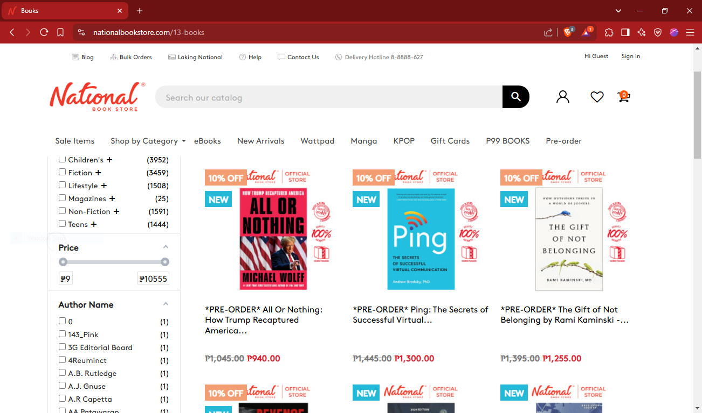

# 📖 National Bookstore Webscraping Python Script

## 📌 Overview

🔹 My second attempt of creating a web scraping tool to aquire book titles and pages from 25 pages of the NBS website.  
🔹 The first draft was lost due to the reset of my laptop.  
🔹 The project is a step into data science starting with acquiring real-world data, providing hands-on experience in data.  

### **Project Goal:**

🏗️ Develop a Python Script to acquire product details from multiple pages of a live webiste.

### **Tools Used:**

🐍 **Python** (Pandas, Request, BeautifulSoup)

### **Target Website:**

👇 **Webscraping** was done March 31, 2025  

## 🔍 Key Insights

🔹 **BeautifulSoup:** Parsing HTML data from the web.  
🔹 **String Manipulation:** String clean up to prepare for storage in .csv format  

## 📊 Project Files

- 🐍 **Python Script:** [Download Python Script](https://github.com/RemyRoams/NBS-WebScraping/blob/main/NBS_Scrape.py)
- 📊 **Output Data:** [Download Dataset](https://github.com/RemyRoams/NBS-WebScraping/blob/main/NSB_Book_Price.csv)

## 🚀 Future Improvements

✅ **Optimize** book title scraping through further parsing of the website's html.  
✅ Polish string parsing with **RegEx**.  
✅ Automate **data acquicision** to handle larger number of webpages.  

---

This project is an **application of python**, creating a working script to **acquire data** through scraping a live website.
